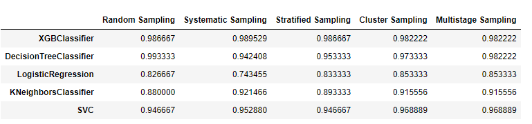

# CreditCard-Data-Analysis

## Description

### Classification models used :
* XGB Classifier
* Decision Tree
* Logistic Regression
* KNN
* SVM

### Sampling methods used :
* Random Sampling
* Systematic Sampling
* Stratified Sampling
* Cluster Sampling
* Multistage Sampling

### Formula used : 
* Size of sample in random sampling n=(Z^2*p*(1-p))/E^2
* Size of sample in stratified sampling n=(Z^2*p*(1-p))/(E/S)^2
* Size of sample in cluster sampling n=(Z^2*p*(1-p))/(E/C)^2
* Size of sample in systematic sampling n=N/(1+(N*E^2)
* Size of sample in multistage sampling is calculated using same formula as random sampling and random sample is used in both stages.

## Results

### Best Model : Decision Tree
### Best Accuracy : 99.33%
### Sampling Technique : Random Sampling

